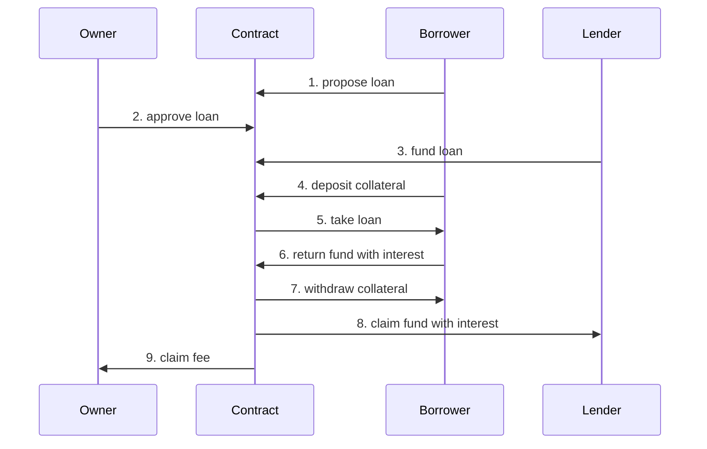
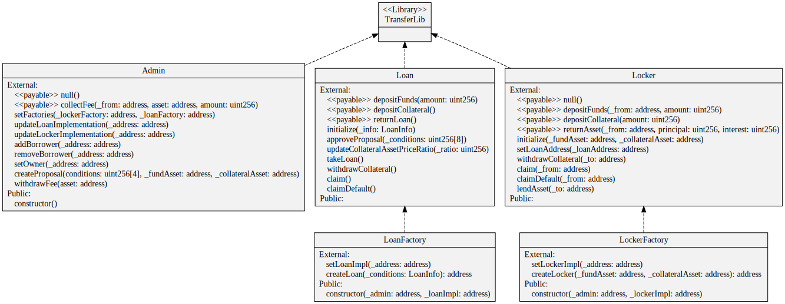

# Sample Hardhat Project

This project demonstrates a basic Hardhat use case. It comes with a sample contract, a test for that contract, and a script that deploys that contract.

Try running some of the following tasks:

```shell
npx hardhat help
npx hardhat test
REPORT_GAS=true npx hardhat test
npx hardhat node
npx hardhat run scripts/deploy.ts
```

# Project Description

## Outline

Simple project for smart contract working as lending platform.

## Details

### players

there are 3 roles for this service,

- borrower: borrows funds and pays back with borrowerInterest
- lender: lends funds and gets lenderInterest
- admin: verify loan condition and approves loan, monetize from interest difference



### contracts



## Clone Factory Pattern's Gas Efficiency

- check gas consumption of `createProposal` function
- `3997338` -> `479817`: saved `3517521` gas
<details>
  <summary>gas usage without clone</summary>

following result comes from running testcodes with REPORT_GAS=true option

```bash
·--------------------------------|----------------------------|-------------|-----------------------------·
|      Solc version: 0.8.19      ·  Optimizer enabled: false  ·  Runs: 200  ·  Block limit: 30000000 gas  │
·································|····························|·············|······························
|  Methods                                                                                                │
··············|··················|··············|·············|·············|···············|··············
|  Contract   ·  Method          ·  Min         ·  Max        ·  Avg        ·  # calls      ·  usd (avg)  │
··············|··················|··············|·············|·············|···············|··············
|  Admin      ·  addBorrower     ·       46409  ·      46421  ·      46417  ·            3  ·          -  │
··············|··················|··············|·············|·············|···············|··············
|  Admin      ·  collectFee      ·       45135  ·      83712  ·      64424  ·            4  ·          -  │
··············|··················|··············|·············|·············|···············|··············
|  Admin      ·  createProposal  ·           -  ·          -  ·    3997338  ·            1  ·          -  │
··············|··················|··············|·············|·············|···············|··············
|  Admin      ·  removeBorrower  ·           -  ·          -  ·      24522  ·            1  ·          -  │
··············|··················|··············|·············|·············|···············|··············
|  Admin      ·  setFactories    ·       69010  ·      69022  ·      69016  ·            2  ·          -  │
··············|··················|··············|·············|·············|···············|··············
|  Admin      ·  setOwner        ·           -  ·          -  ·      27157  ·            1  ·          -  │
··············|··················|··············|·············|·············|···············|··············
|  Admin      ·  withdrawFee     ·       31551  ·      37980  ·      34766  ·            2  ·          -  │
··············|··················|··············|·············|·············|···············|··············
|  MockToken  ·  approve         ·           -  ·          -  ·      46900  ·            2  ·          -  │
··············|··················|··············|·············|·············|···············|··············
|  MockToken  ·  mint            ·           -  ·          -  ·      68928  ·            1  ·          -  │
··············|··················|··············|·············|·············|···············|··············
|  Deployments                   ·                                          ·  % of limit   ·             │
·································|··············|·············|·············|···············|··············
|  Admin                         ·           -  ·          -  ·    1752539  ·        5.8 %  ·          -  │
·································|··············|·············|·············|···············|··············
|  LoanFactory                   ·           -  ·          -  ·    2962749  ·        9.9 %  ·          -  │
·································|··············|·············|·············|···············|··············
|  LockerFactory                 ·           -  ·          -  ·    2027764  ·        6.8 %  ·          -  │
·································|··············|·············|·············|···············|··············
|  MockToken                     ·           -  ·          -  ·    1238799  ·        4.1 %  ·          -  │
·--------------------------------|--------------|-------------|-------------|---------------|-------------·
```

</details>

<details>
  <summary>gas usage with clone</summary>

following result comes from running testcodes with REPORT_GAS=true option

```bash
·--------------------------------|----------------------------|-------------|-----------------------------·
|      Solc version: 0.8.19      ·  Optimizer enabled: false  ·  Runs: 200  ·  Block limit: 30000000 gas  │
·································|····························|·············|······························
|  Methods                                                                                                │
··············|··················|··············|·············|·············|···············|··············
|  Contract   ·  Method          ·  Min         ·  Max        ·  Avg        ·  # calls      ·  usd (avg)  │
··············|··················|··············|·············|·············|···············|··············
|  Admin      ·  addBorrower     ·       46409  ·      46421  ·      46417  ·            3  ·          -  │
··············|··················|··············|·············|·············|···············|··············
|  Admin      ·  collectFee      ·       45135  ·      83712  ·      64424  ·            4  ·          -  │
··············|··················|··············|·············|·············|···············|··············
|  Admin      ·  createProposal  ·           -  ·          -  ·     479817  ·            1  ·          -  │
··············|··················|··············|·············|·············|···············|··············
|  Admin      ·  removeBorrower  ·           -  ·          -  ·      24522  ·            1  ·          -  │
··············|··················|··············|·············|·············|···············|··············
|  Admin      ·  setFactories    ·           -  ·          -  ·      69022  ·            2  ·          -  │
··············|··················|··············|·············|·············|···············|··············
|  Admin      ·  setOwner        ·           -  ·          -  ·      27157  ·            1  ·          -  │
··············|··················|··············|·············|·············|···············|··············
|  Admin      ·  withdrawFee     ·       31551  ·      37980  ·      34766  ·            2  ·          -  │
··············|··················|··············|·············|·············|···············|··············
|  MockToken  ·  approve         ·           -  ·          -  ·      46900  ·            2  ·          -  │
··············|··················|··············|·············|·············|···············|··············
|  MockToken  ·  mint            ·           -  ·          -  ·      68928  ·            1  ·          -  │
··············|··················|··············|·············|·············|···············|··············
|  Deployments                   ·                                          ·  % of limit   ·             │
·································|··············|·············|·············|···············|··············
|  Admin                         ·           -  ·          -  ·    1752539  ·        5.8 %  ·          -  │
·································|··············|·············|·············|···············|··············
|  Loan                          ·           -  ·          -  ·    2489567  ·        8.3 %  ·          -  │
·································|··············|·············|·············|···············|··············
|  LoanFactory                   ·      551002  ·     551014  ·     551012  ·        1.8 %  ·          -  │
·································|··············|·············|·············|···············|··············
|  Locker                        ·           -  ·          -  ·    1767583  ·        5.9 %  ·          -  │
·································|··············|·············|·············|···············|··············
|  LockerFactory                 ·      412249  ·     412261  ·     412259  ·        1.4 %  ·          -  │
·································|··············|·············|·············|···············|··············
|  MockToken                     ·           -  ·          -  ·    1238799  ·        4.1 %  ·          -  │
·--------------------------------|--------------|-------------|-------------|---------------|-------------·
```

</details>

## test deployment from local hardhat node

```bash
yarn hardhat node
yarn hardhat run scripts/deploy.ts
```

you'll get following output after deployment

```bash
admin deployed: 0x5FbDB2315678afecb367f032d93F642f64180aa3
loan deployed: 0xe7f1725E7734CE288F8367e1Bb143E90bb3F0512
locker deployed: 0x9fE46736679d2D9a65F0992F2272dE9f3c7fa6e0
loanFactory deployed: 0xCf7Ed3AccA5a467e9e704C703E8D87F634fB0Fc9
lockerFactory deployed: 0xDc64a140Aa3E981100a9becA4E685f962f0cF6C9
✨  Done in 1.21s.
```

## Todos (archived)
<details>
  <summary> archived </summary>
  
  - [x] Set different assets for collateral and funding
  - [x] Default & Liquidate functionality
  - [x] test codes for Default & Liquidate functionality
  - [x] Separate basic transfer functionality working for both erc20 and native token
  - [x] limit function call directly from locker
  - [x] complete function call auth check
  - [x] update test codes for native tokens
  - [ ] ~~diamondcut pattern adoption~~
  - [x] clone factory pattern adpotion
  - [x] scenario test codes
  - [x] update readme with detailed description
  - [x] add deploy scripts

</details>

